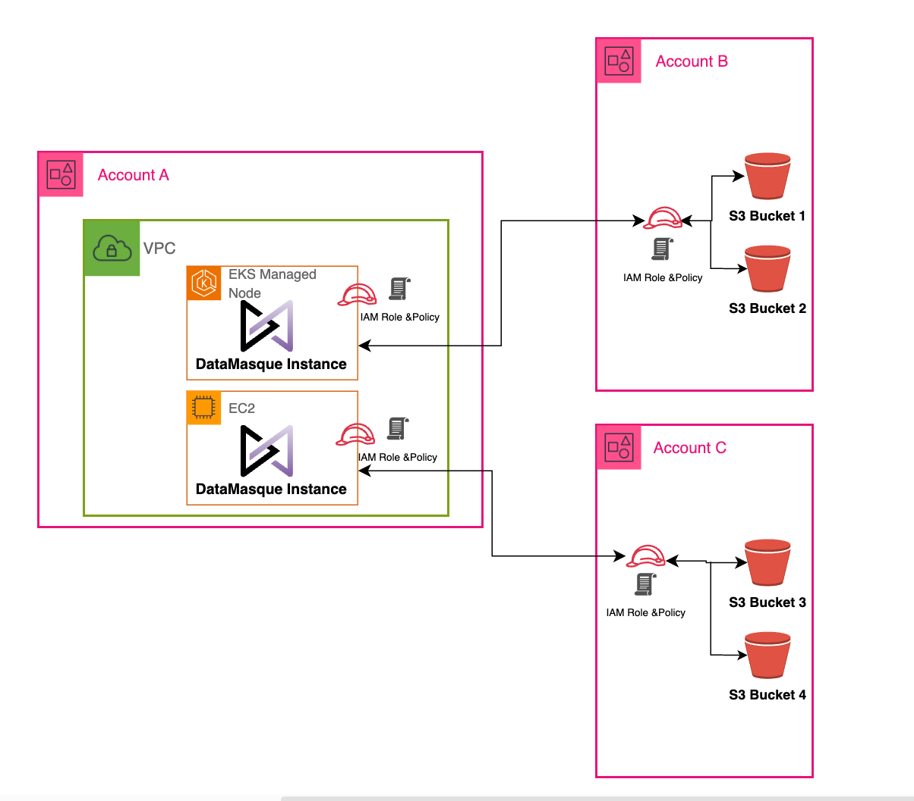

# Enabling Cross-Account Access to S3 Buckets for DataMasque Using IAM Roles

This guide explains how to configure cross-account access to S3 buckets using IAM roles, enabling DataMasque deployed on EC2 or an EKS cluster in one AWS account to access buckets in other AWS accounts.

While the provided CloudFormation templates establish a foundational setup for cross-account access, we understand that security needs can vary widely across different deployments. You are encouraged to modify these templates to tailor the security settings to your specific requirements. 

## Scenario Overview
Imagine you have DataMasque deployed on EC2 or an EKS cluster in Account A. You need to enable DataMasque to access all the S3 buckets located in Accounts B and C.



The following lists the  AWS resources provisioned when these CloudFormation templates is deployed:

- IAM Policy;
- IAM Role with S3 Permissions;

## Deployment
To manage this setup, we use cross-account IAM roles. Below is a description of the roles and policies across the different accounts:

### Prerequisites

- AWS CLI configured with appropriate credential for the target AWS account.
- A DataMasque instance Role ARN and Name, for ec2 deployments or EKS Role Name/Arn for EKS deployments

### In Account DataMasque is hosted (we will call Account A):

This template will create the IAM role that DataMasque's EC2 or EKS instance will assume, and it attaches a policy that enables the role to assume roles in other accounts. The policy provide access to Assume all roles named `datamasque-crossaccount-role` in every account `arn:aws:iam::*:role/datamasque-crossaccount-role`.

[datamasque-crossaccount-policy-datamasque-hosted.yaml](datamasque-crossaccount-policy-datamasque-hosted.yaml)

Note: The CloudFormation require the Role name to be used as parameter.

```shell
export RoleName=
aws cloudformation create-stack \
  --stack-name datamasque-crossaccount-policy \
  --template-body file://datamasque-crossaccount-policy-datamasque-hosted.yaml \
  --parameters \
        ParameterKey=PolicyName,ParameterValue=datamasque-crossaccount-policy \
        ParameterKey=AssumableRoleName,ParameterValue=datamasque-crossaccount-role \
        ParameterKey=Entity,ParameterValue=${RoleName} \
  --capabilities CAPABILITY_NAMED_IAM
```

### Other accounts

#### Source (Read Only):

This template will create an IAM role that can be assumed by the role in Account A, and it attaches a policy that specifies read only to all S3 buckets for discovery and read. The template will create a Role named `datamasque-crossaccount-role` using the AWS Managed Policy `arn:aws:iam::aws:policy/AmazonS3ReadOnlyAccess`. It's recommended to use this template in accounts defining as Source of the data, Production, etc.

[datamasque-crossaccount-role-RO.yaml](datamasque-crossaccount-role-RO.yaml)

```shell
export DataMasqueRoleARN=arn:aws:iam::<account>>:role/<EC2/EKS role>
aws cloudformation create-stack \
  --stack-name datamasque-crossaccount-role\
  --template-body file://datamasque-crossaccount-role-RO.yaml \
  --parameters \
        ParameterKey=RoleName,ParameterValue=datamasque-crossaccount-role \
        ParameterKey=DataMasqueRoleARN,ParameterValue=${DataMasqueRoleARN} \
  --capabilities CAPABILITY_NAMED_IAM
```

#### Destination (Read Write):
This template will create an IAM role that can be assumed by the role in Account A, and it attaches a policy that specifies read write to all S3 buckets for masking and write. The template will create a Role named `datamasque-crossaccount-role` and also a policy required for Writing files `datamasque-crossacount-policy`. It's recommended to use this template in accounts defining as Destination of the data, non production, etc.

[datamasque-crossaccount-role-RW-dest.yaml](datamasque-crossaccount-role-RW-dest.yaml)

```shell
export DataMasqueRoleARN=arn:aws:iam::<account>>:role/<EC2/EKS role>
aws cloudformation create-stack \
  --stack-name datamasque-crossaccount-role \
  --template-body file://datamasque-crossaccount-role-RW-dest.yaml \
  --parameters \
        ParameterKey=RoleName,ParameterValue=datamasque-crossaccount-role \
        ParameterKey=DataMasqueRoleARN,ParameterValue=${DataMasqueRoleARN} \
  --capabilities CAPABILITY_NAMED_IAM
```


