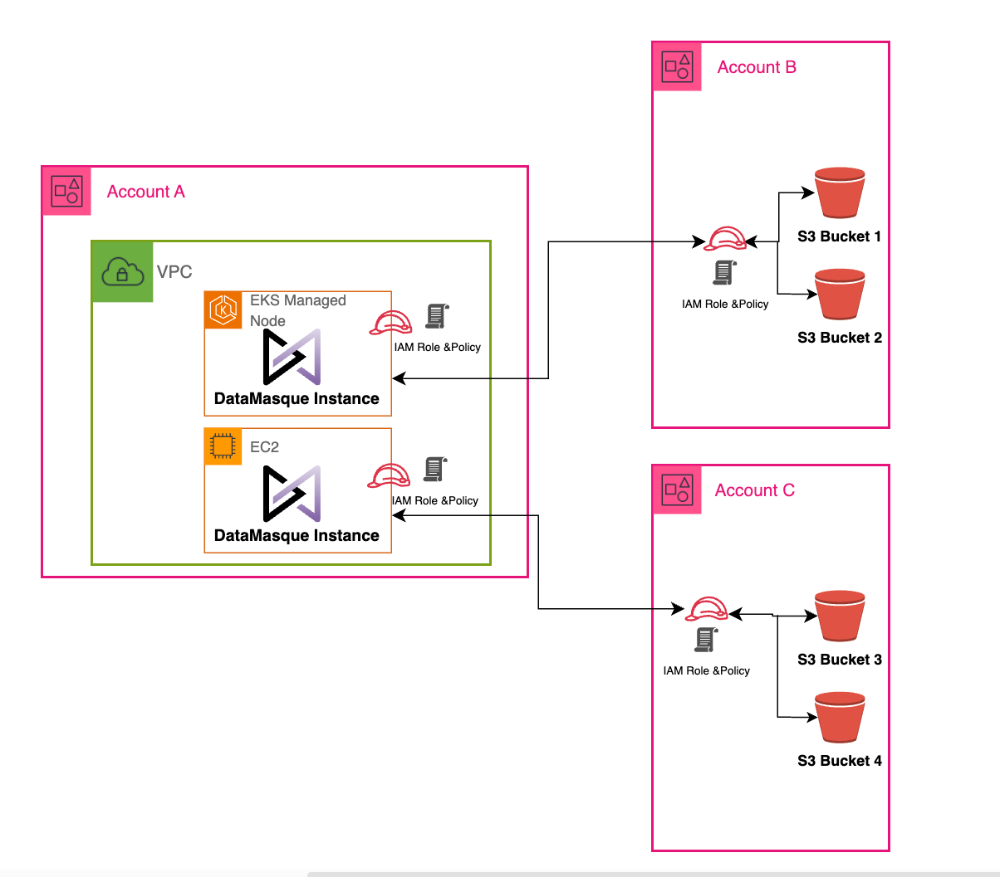

# DataMasque — Cross-Account S3 Bucket Access

> **Reference blueprint — adapt to your environment.** This repository is a
> starting point, not a turnkey product. Review and harden IAM, networking,
> secrets, and TLS for your own environment before any production use.

[DataMasque](https://datamasque.com) replaces sensitive production data with
synthetically identical customer data so teams can build, test, and share against
non-production datasets without ever exposing real PII. This blueprint solves
the access half of S3 file masking: it provisions the IAM roles and policies a
DataMasque instance (running on EC2 or EKS) needs to read source objects and
write masked output to destination S3 buckets — whether those buckets live in
the **same** AWS account as DataMasque or in a **different** account reached via
cross-account IAM roles or bucket policies. The result is least-privilege access
scoped to the exact buckets and prefixes you name, so masking never touches more
than it must.

**Learn more:** [datamasque.com](https://datamasque.com) ·
[Product docs](https://datamasque.com/portal/documentation/) ·
[Book a demo](https://datamasque.com/request-a-demo)

---

For the full S3 access guide, see the
[file-connections documentation](https://datamasque.com/portal/documentation/latest/file-connections.html#configuring-access-between-datamasque-and-aws-s3-buckets).


## Introduction

This repository contains CloudFormation templates for deploying the IAM roles and
policies that configure access between the DataMasque application (running on EC2
instances or EKS clusters) and AWS S3 buckets. Three scenarios are documented
below, covering same-account and cross-account access patterns.



### Prerequisites

- AWS CLI configured with the appropriate credentials for the target AWS account.
- A DataMasque instance role — its **name** for EC2 deployments, and its **ARN**
  where a cross-account trust relationship is required (Scenario 2). The same
  applies to the EKS role for EKS deployments.

> **Replace every example value.** The bucket names, prefixes, role names, and
> account IDs below are placeholders for illustration only. Replace **all** ARNs,
> bucket names, and account IDs with your own before deploying — none of them are
> real.

## Scenario 1: DataMasque accesses source and destination buckets in the same AWS account

The CloudFormation template deploys an IAM policy and attaches it to the IAM role
assigned to the EC2 instance running the DataMasque application. This setup
enables the DataMasque application to mask data in source S3 buckets and write the
masked data to destination S3 buckets. If the source and target S3 buckets are in
the same AWS account as the DataMasque application, no additional configuration is
needed.

Required CloudFormation parameters:
  - `DmRoleName`: The **name** of the IAM role attached to the EC2 instance running the DataMasque application.
  - `SourceBuckets`: Comma-separated ARNs of the source S3 buckets where data needs to be masked.
  - `DestinationBuckets`: Comma-separated ARNs of the target S3 buckets where masked data will be written.
  - `SourceBucketsPrefixes`: Comma-separated ARNs of the source S3 buckets with prefixes indicating where the data to be masked is stored.
  - `DestinationBucketsPrefixes`: Comma-separated ARNs of the destination S3 buckets with prefixes indicating where the masked data is to be stored.
  - `KmsKeyArns` (optional): Comma-separated ARNs of the SSE-KMS keys protecting the buckets. Leave unset for SSE-S3 (AES256) buckets.

```shell
export DmRoleName=DataMasque-Role
export DestinationBucketsArns=arn:aws:s3:::dest-bucket1,arn:aws:s3:::dest-bucket2
export SourceBucketsArns=arn:aws:s3:::source-bucket1,arn:aws:s3:::source-bucket2
export DestinationBucketsPrefixes=arn:aws:s3:::dest-bucket1/masked_data/*,arn:aws:s3:::dest-bucket2/masked_data/*
export SourceBucketsPrefixes=arn:aws:s3:::source-bucket1/unmasked/credit_card_data/*,arn:aws:s3:::source-bucket2/unmasked/user_data/*
aws cloudformation create-stack \
  --stack-name datamasque-aws-account-s3bucket-access \
  --template-body file://datamasque-s3-bucket-access-iam-policy.yaml \
  --parameters \
        ParameterKey=PolicyName,ParameterValue=datamasque-aws-account-policy \
        ParameterKey=DestinationBuckets,ParameterValue=\"${DestinationBucketsArns}\" \
        ParameterKey=SourceBuckets,ParameterValue=\"${SourceBucketsArns}\" \
        ParameterKey=SourceBucketsPrefixes,ParameterValue=\"${SourceBucketsPrefixes}\" \
        ParameterKey=DestinationBucketsPrefixes,ParameterValue=\"${DestinationBucketsPrefixes}\" \
        ParameterKey=DmRoleName,ParameterValue=${DmRoleName} \
  --capabilities CAPABILITY_NAMED_IAM CAPABILITY_AUTO_EXPAND
```

> If your buckets are encrypted with SSE-KMS, also pass
> `ParameterKey=KmsKeyArns,ParameterValue=\"arn:aws:kms:REGION:111111111111:key/KEY-ID\"`
> so masking can decrypt source objects and encrypt masked output.

## Scenario 2: DataMasque accesses source and destination buckets in different AWS accounts using cross-account IAM roles

This scenario requires deploying the CloudFormation stack
(`datamasque-crossaccount-access`) in the AWS account where the DataMasque
application is running, **and** the CloudFormation stack
(`datamasque-crossaccount-s3bucket-access`) in the AWS account where the buckets
are configured.

The `datamasque-crossaccount-access` stack deploys an IAM policy containing
`sts:AssumeRole` permissions and attaches it to the IAM role assigned to the EC2
instance running the DataMasque application.

The `datamasque-crossaccount-s3bucket-access` stack deploys an IAM role that can
be assumed by the IAM role attached to the EC2 instance running the DataMasque
application. It also deploys policies that allow the DataMasque application to
perform masking operations on the specified S3 buckets.

### Step 2a — DataMasque account

Required parameters for CloudFormation stack `datamasque-crossaccount-access`:
  - `DmRoleName`: The **name** of the IAM role attached to the EC2 instance running the DataMasque application.
  - `CrossAccountRoles`: Comma-separated ARNs of the IAM roles deployed in the AWS accounts where the source buckets that require data masking are configured.

```shell
export DmRoleName=DataMasque-Role
export CrossAccountRoles=arn:aws:iam::222222222222:role/datamasque-s3bucket-access-role,arn:aws:iam::333333333333:role/datamasque-s3bucket-access-role,arn:aws:iam::444444444444:role/datamasque-s3bucket-access-role
aws cloudformation create-stack \
  --stack-name datamasque-crossaccount-access \
  --template-body file://datamasque-crossaccount-access.yaml \
  --parameters \
        ParameterKey=PolicyName,ParameterValue=datamasque-crossaccount-policy \
        ParameterKey=CrossAccountRoles,ParameterValue=\"${CrossAccountRoles}\" \
        ParameterKey=DmRoleName,ParameterValue=${DmRoleName} \
  --capabilities CAPABILITY_NAMED_IAM CAPABILITY_AUTO_EXPAND
```

### Step 2b — bucket account

Required parameters for CloudFormation stack `datamasque-crossaccount-s3bucket-access`:
  - `DmRoleArn`: The **ARN** of the IAM role attached to the EC2 instance running the DataMasque application. This is the principal trusted to assume the cross-account role.
  - `CrossAccountRole`: The **name** of the IAM role created by this stack and assumed by the DataMasque application to perform masking operations on the S3 buckets.
  - `SourceBuckets`: Comma-separated ARNs of the source S3 buckets where data needs to be masked.
  - `DestinationBuckets`: Comma-separated ARNs of the target S3 buckets where masked data will be written.
  - `SourceBucketsPrefixes`: Comma-separated ARNs of the source S3 buckets with prefixes indicating where the data to be masked is stored.
  - `DestinationBucketsPrefixes`: Comma-separated ARNs of the destination S3 buckets with prefixes indicating where the masked data is to be stored.
  - `KmsKeyArns` (optional): Comma-separated ARNs of the SSE-KMS keys protecting the buckets. Leave unset for SSE-S3 (AES256) buckets.

This CloudFormation stack should be deployed in the AWS account where the S3
buckets are configured.

```shell
# DmRoleArn is the ARN of the DataMasque EC2 instance role from the DataMasque
# account — it is the principal trusted to assume the cross-account role.
export DmRoleArn=arn:aws:iam::111111111111:role/DataMasque-Role
export DestinationBucketsArns=arn:aws:s3:::dest-bucket1,arn:aws:s3:::dest-bucket2
export SourceBucketsArns=arn:aws:s3:::source-bucket1,arn:aws:s3:::source-bucket2
export DestinationBucketsPrefixes=arn:aws:s3:::dest-bucket1/masked_data/*,arn:aws:s3:::dest-bucket2/masked_data/*
export SourceBucketsPrefixes=arn:aws:s3:::source-bucket1/unmasked/credit_card_data/*,arn:aws:s3:::source-bucket2/unmasked/user_data/*
export CrossAccountRole=datamasque-s3bucket-access-role
aws cloudformation create-stack \
  --stack-name datamasque-crossaccount-s3bucket-access \
  --template-body file://datamasque-crossaccount-s3bucket-access.yaml \
  --parameters \
        ParameterKey=CrossAccountRole,ParameterValue=${CrossAccountRole} \
        ParameterKey=DestinationBuckets,ParameterValue=\"${DestinationBucketsArns}\" \
        ParameterKey=SourceBuckets,ParameterValue=\"${SourceBucketsArns}\" \
        ParameterKey=SourceBucketsPrefixes,ParameterValue=\"${SourceBucketsPrefixes}\" \
        ParameterKey=DestinationBucketsPrefixes,ParameterValue=\"${DestinationBucketsPrefixes}\" \
        ParameterKey=DmRoleArn,ParameterValue=${DmRoleArn} \
  --capabilities CAPABILITY_NAMED_IAM CAPABILITY_AUTO_EXPAND
```

> `CrossAccountRole` is a role **name** (used to create the role), while
> `DmRoleArn` is the full **ARN** of the DataMasque EC2 role in the other account.
> Passing an ARN where a name is expected (or vice versa) will fail the stack.

## Scenario 3: DataMasque accesses source and destination buckets in different AWS accounts using bucket policies

In this scenario, when the DataMasque application and the source/destination
buckets are in different AWS accounts, in addition to deploying the CloudFormation
stack from Scenario 1, you also apply the following bucket policies to the
respective source and destination buckets.

> When you deploy the Scenario 1 stack for this pattern, its `SourceBuckets`,
> `DestinationBuckets`, `SourceBucketsPrefixes`, and `DestinationBucketsPrefixes`
> parameters must name the **remote** buckets in the other account — the identity
> policy on the DataMasque role and the bucket policies below both have to grant
> access to the same buckets, or masking fails with `AccessDenied`.

Source bucket policy:

```json
{
    "Version": "2012-10-17",
    "Statement": [
        {
            "Sid": "SourceBucketRead",
            "Effect": "Allow",
            "Principal": {
                "AWS": [
                    "arn:aws:iam::111111111111:role/DM-Role"
                ]
            },
            "Action": [
                "s3:GetObject"
            ],
            "Resource": [
                "arn:aws:s3:::<bucket-name>",
                "arn:aws:s3:::<bucket-name>/*"
            ]
        },
        {
            "Sid": "SourceBucketPermissionCheck",
            "Effect": "Allow",
            "Principal": {
                "AWS": [
                    "arn:aws:iam::111111111111:role/DM-Role"
                ]
            },
            "Action": [
                "s3:ListBucket*",
                "s3:GetBucketAcl",
                "s3:GetBucketPolicyStatus",
                "s3:GetBucketPublicAccessBlock",
                "s3:GetBucketObjectLockConfiguration",
                "s3:GetEncryptionConfiguration"
            ],
            "Resource": [
                "arn:aws:s3:::<bucket-name>"
            ]
        },
        {
            "Sid": "AllowSSLRequestsOnly",
            "Effect": "Deny",
            "Principal": "*",
            "Action": "s3:*",
            "Resource": [
                "arn:aws:s3:::<bucket-name>",
                "arn:aws:s3:::<bucket-name>/*"
            ],
            "Condition": {
                "Bool": {
                    "aws:SecureTransport": "false"
                }
            }
        }
    ]
}
```

Destination bucket policy:

```json
{
    "Version": "2012-10-17",
    "Statement": [
        {
            "Sid": "DestinationBucketWrite",
            "Effect": "Allow",
            "Principal": {
                "AWS": [
                    "arn:aws:iam::111111111111:role/DM-Role"
                ]
            },
            "Action": [
                "s3:PutObject",
                "s3:GetObject",
                "s3:DeleteObject"
            ],
            "Resource": [
                "arn:aws:s3:::<bucket-name>",
                "arn:aws:s3:::<bucket-name>/*"
            ]
        },
        {
            "Sid": "DestinationBucketSecurityCheck",
            "Effect": "Allow",
            "Principal": {
                "AWS": [
                    "arn:aws:iam::111111111111:role/DM-Role"
                ]
            },
            "Action": [
                "s3:ListBucket*",
                "s3:GetBucketAcl",
                "s3:GetBucketPolicyStatus",
                "s3:GetBucketPublicAccessBlock",
                "s3:GetBucketObjectLockConfiguration",
                "s3:GetEncryptionConfiguration"
            ],
            "Resource": [
                "arn:aws:s3:::<bucket-name>"
            ]
        },
        {
            "Sid": "AllowSSLRequestsOnly",
            "Effect": "Deny",
            "Principal": "*",
            "Action": "s3:*",
            "Resource": [
                "arn:aws:s3:::<bucket-name>",
                "arn:aws:s3:::<bucket-name>/*"
            ],
            "Condition": {
                "Bool": {
                    "aws:SecureTransport": "false"
                }
            }
        }
    ]
}
```

Replace `arn:aws:iam::111111111111:role/DM-Role` with the actual ARN of the role
attached to the EC2 instance running the DataMasque application, and replace every
`<bucket-name>` with your own bucket.

### SSE-KMS encrypted buckets

If the remote buckets are encrypted with SSE-KMS, the bucket policies above are not
enough. A KMS key has its own resource policy in the account that owns it, and AWS
requires **both** sides to authorise: the DataMasque role's identity policy (the
`KmsKeyArns` parameter on the Scenario 1 stack grants `kms:Decrypt` and
`kms:GenerateDataKey`) **and** the key policy in the bucket account. Without the key
policy grant everything deploys cleanly, but masking fails with `AccessDenied` the
moment it touches an encrypted object.

Add the DataMasque role as a principal on the key policy of each key protecting a
source or destination bucket:

```json
{
    "Sid": "AllowDataMasqueUseOfTheKey",
    "Effect": "Allow",
    "Principal": {
        "AWS": "arn:aws:iam::111111111111:role/DM-Role"
    },
    "Action": [
        "kms:Decrypt",
        "kms:GenerateDataKey"
    ],
    "Resource": "*"
}
```

`"Resource": "*"` in a key policy scopes to the key the policy is attached to, not
to every key in the account. Scenario 2 does not need this step — the cross-account
role it creates lives in the same account as the key, so the identity policy alone
satisfies KMS.

---

## Related DataMasque blueprints

- [AWS RDS masking (Step Functions)](https://github.com/datamasque/DataMasque-AWS-RDS-masking-stepfunctions-blueprint)
- [Azure DB masking (Logic Apps)](https://github.com/datamasque/DataMasque-Azure-DB-masking-logicapps-blueprint)
- [AWS Service Catalog DB provisioning](https://github.com/datamasque/DataMasque-AWS-service-catalog-database-provisioning-blueprint)
- [AWS ECS Deployment](https://github.com/datamasque/DataMasque-AWS-ECS-Deployment)
- [masque-bricks (Databricks)](https://github.com/datamasque/masque-bricks)
